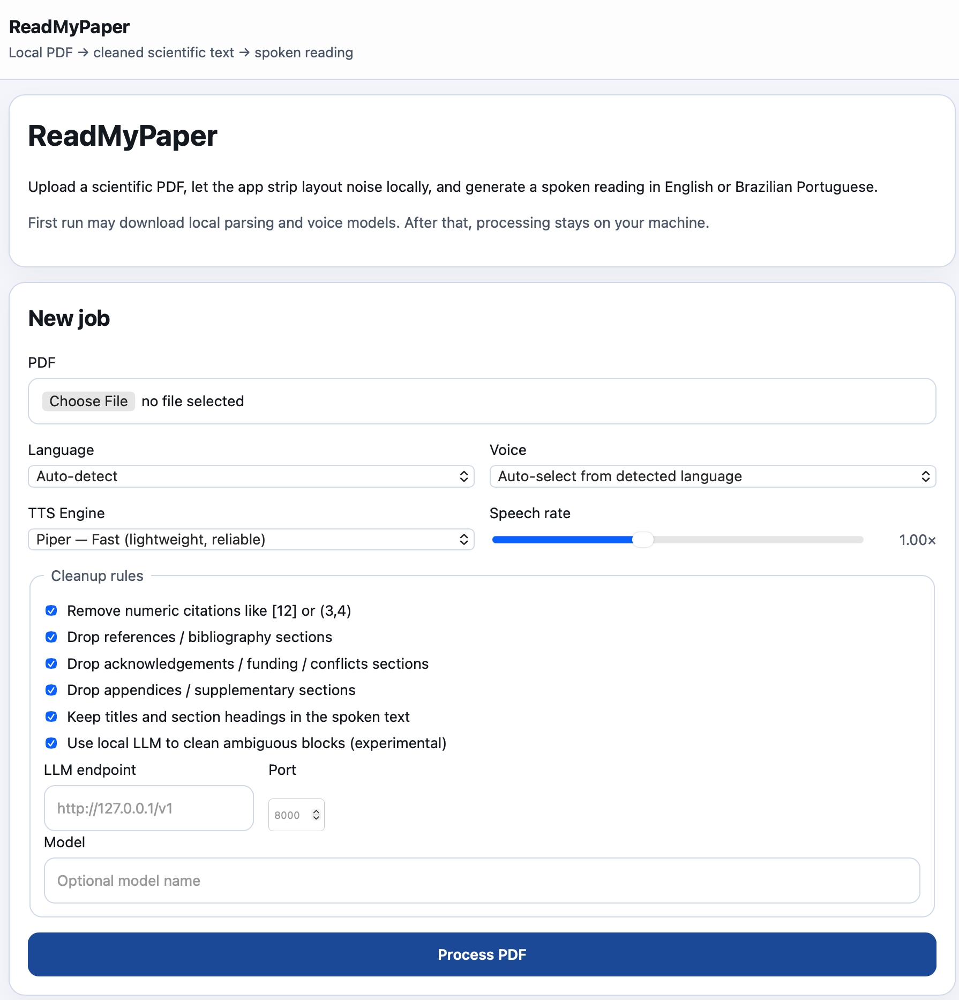
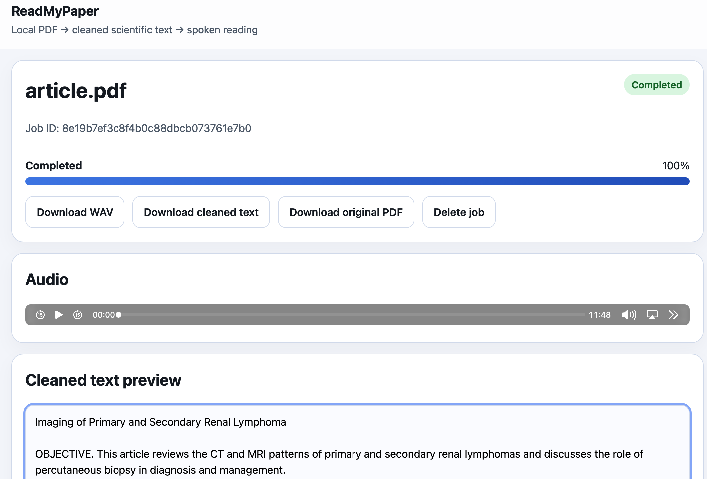

# ReadMyPaper

ReadMyPaper is a local Python web app for turning scientific PDFs into spoken audio.

It is built for articles and papers rather than generic office PDFs. The pipeline:

1. uploads a PDF through a local web UI,
2. parses it with a layout-aware scientific document engine (Docling),
3. **repairs reading order** for multi-column layouts using bounding box analysis,
4. **filters by section whitelist** — keeps only body sections (Abstract, Methods, Results, Discussion, Conclusion) and drops front/end matter (authors, affiliations, keywords, acknowledgements, references, data availability, etc.),
5. **applies a spatial layout filter** that drops text fragments overlapping figures and tables,
6. optionally runs an **LLM cleaner** to classify ambiguous blocks,
7. **verbalises** scientific notation for natural listening (e.g. `224×224` → "224 by 224", `p<0.05` → "p less than 0.05"),
8. generates a local WAV audio reading with a neural TTS engine.

ReadMyPaper supports Linux, macOS, and Windows.

| Upload and cleanup options | Cleaned text preview |
| --- | --- |
|  |  |

## What it supports

- Local processing by default after initial model download
- English and Brazilian Portuguese voices out of the box
- Scientific-paper cleanup oriented to listening
- Web UI served locally with FastAPI
- WAV audio output for broad compatibility
- Download of original PDF, cleaned text, and audio
- Two TTS modes: **Piper** (fast, lightweight) and **Kokoro** (quality, more natural voice)
- Optional **LLM cleaning** via OpenAI-compatible endpoint

## Architecture

- **PDF extraction / layout understanding:** Docling
- **Reading order repair:** bbox-based column detection and reordering
- **Text cleanup:** section whitelist + front/end-matter regex + spatial layout filter + optional LLM cleaner
- **TTS verbaliser:** scientific notation and abbreviation expansion for natural listening
- **TTS (fast mode):** Piper (local neural TTS)
- **TTS (quality mode):** Kokoro (82M-parameter open-weight TTS)
- **Web UI:** FastAPI + Jinja templates + vanilla JavaScript

The cleanup pipeline runs in five stages:

1. **Reading order repair** — detects 2-column layouts and reorders blocks by column then y-position
2. **Section whitelist** — keeps body sections (Abstract, Methods, Results, etc.), drops metadata sections
3. **Layout spatial filter** — removes text overlapping figure/table bounding boxes
4. **LLM ambiguity cleaner** (optional) — classifies edge-case blocks via a configured OpenAI-compatible API
5. **TTS verbaliser** — expands abbreviations, measurements, and notation for spoken output

## Project layout

```text
ReadMyPaper/
├── pyproject.toml
├── requirements.txt
├── README.md
├── scripts/
│   └── predownload_voices.py
├── readmypaper/
│   ├── main.py
│   ├── config.py
│   ├── job_store.py
│   ├── types.py
│   ├── services/
│   │   ├── pdf_extractor.py
│   │   ├── reading_order.py
│   │   ├── layout_filter.py
│   │   ├── llm_cleaner.py
│   │   ├── tts_verbalizer.py
│   │   ├── pipeline.py
│   │   ├── text_cleaner.py
│   │   ├── tts_piper.py
│   │   ├── tts_kokoro.py
│   │   └── voice_catalog.py
│   ├── static/
│   │   ├── app.js
│   │   └── styles.css
│   └── templates/
│       ├── base.html
│       ├── index.html
│       └── job.html
└── tests/
    ├── test_chunking.py
    ├── test_layout_filter.py
    ├── test_reading_order.py
    ├── test_text_cleaner.py
    └── test_verbalizer.py
```

## Installation

### Quick Install (Package)

Use this path when you want to install and run ReadMyPaper as an application:

```bash
python -m pip install --upgrade pip
python -m pip install readmypaper
readmypaper
```

For **Kokoro quality TTS** (optional, higher quality with extra dependencies),
install the package extra instead:

```bash
python -m pip install "readmypaper[kokoro]"
readmypaper
```

Kokoro also requires the `espeak-ng` system package. See
[Platform Support](#platform-support) for platform-specific install commands.
The default **Piper TTS** mode does not need system packages beyond what pip
installs.

### Development Setup (From Source)

Use this path when you are working from a source checkout.

#### Linux and macOS

```bash
python3.12 -m venv .venv
source .venv/bin/activate
python -m pip install --upgrade pip
python -m pip install -r requirements.txt
python -m readmypaper.main
```

#### Windows (PowerShell)

```powershell
py -3.12 -m venv .venv
.\.venv\Scripts\Activate.ps1
python -m pip install --upgrade pip
python -m pip install -r requirements.txt
python -m readmypaper.main
```

For Kokoro support from a source checkout, install the optional extra after
creating the virtual environment:

```bash
python -m pip install ".[kokoro]"
```

Both `readmypaper` and `python -m readmypaper.main` print the data and cache
directories on startup. Then open:

```text
http://127.0.0.1:8000
```

## Platform Support

ReadMyPaper requires Python 3.10 or newer on each supported platform.
**Python 3.12 is recommended** — Kokoro TTS currently requires Python < 3.13.

| Platform | Support | Python | Base Piper dependencies | Kokoro `espeak-ng` dependency |
| --- | --- | --- | --- | --- |
| Linux | Supported | 3.12 recommended | Installed by pip | `sudo apt install espeak-ng` on Debian/Ubuntu |
| macOS | Supported | 3.12 recommended | Installed by pip | `brew install espeak-ng` |
| Windows | Supported | 3.12 recommended | Installed by pip | Install from the [eSpeak NG releases](https://github.com/espeak-ng/espeak-ng/releases) |

The base Piper TTS mode has no system dependencies beyond the Python packages
installed by pip.

## Data storage locations

ReadMyPaper stores uploaded PDFs, cleaned text, generated audio, and cached model
or voice assets outside the source tree by default.

Default locations:

| Platform | Data directory | Cache directory |
| --- | --- | --- |
| Linux | `~/.local/share/ReadMyPaper` | `~/.cache/ReadMyPaper` |
| macOS | `~/Library/Application Support/ReadMyPaper` | `~/Library/Caches/ReadMyPaper` |
| Windows | `C:\Users\<user>\AppData\Local\ReadMyPaper` | `C:\Users\<user>\AppData\Local\ReadMyPaper` |

Override these paths with environment variables:

```bash
READMYPAPER_DATA_DIR=/custom/data/path
READMYPAPER_CACHE_DIR=/custom/cache/path
```

Users upgrading from earlier source-based installs may still have files in the
legacy `./outputs` directory at the project root. ReadMyPaper detects a non-empty
legacy directory at startup and prints a warning with both paths so you can
manually move any PDFs, cleaned text, or audio files you still need.

## Data retention and cleanup

By default, ReadMyPaper keeps jobs and their files until you delete them
manually. Uploaded PDFs live under `data_dir/uploads`, and cleaned text, audio,
and `metadata.json` live under `data_dir/outputs`.

Completed jobs are restored into the UI after a restart. Incomplete jobs are
not restored; their directories remain on disk until you remove them manually or
enable time-based cleanup.

To enable TTL-based cleanup on startup, set:

```bash
READMYPAPER_JOB_RETENTION_HOURS=24
```

A value of `0` disables automatic cleanup and retains jobs indefinitely.
Positive values are interpreted as hours since job creation. On startup,
TTL-based cleanup removes restored jobs older than the configured TTL. It also
removes orphan directories under `data_dir/uploads` and `data_dir/outputs`, such
as incomplete uploads or corrupt jobs, when their filesystem modification time is
older than the TTL cutoff.

You can remove data manually in either of these ways:

- delete the data directory shown at startup to remove all stored PDFs, cleaned
  text, audio, and metadata, or
- use the Delete job button on the job page or call `DELETE /jobs/{job_id}` to
  remove one completed or failed job.

The delete action removes both `data_dir/uploads/{job_id}` and
`data_dir/outputs/{job_id}` and drops the job from in-memory state.

## Useful environment variables

| Variable | Default | Purpose |
| --- | --- | --- |
| `READMYPAPER_HOST` | `127.0.0.1` | Bind address for the local web server |
| `READMYPAPER_PORT` | `8000` | Port for the local web server |
| `READMYPAPER_DATA_DIR` | Platform data directory | Uploaded PDFs, cleaned text, generated audio, and metadata |
| `READMYPAPER_CACHE_DIR` | Platform cache directory | Downloaded model and voice assets |
| `READMYPAPER_MAX_WORKERS` | `2` | Maximum background processing workers |
| `READMYPAPER_MAX_UPLOAD_BYTES` | `52428800` | Maximum PDF upload size, 50 MiB by default |
| `READMYPAPER_MAX_PDF_PAGES` | `200` | Maximum accepted PDF page count |
| `READMYPAPER_SPEECH_RATE_MIN` | `0.5` | Minimum accepted speech rate |
| `READMYPAPER_SPEECH_RATE_MAX` | `2.0` | Maximum accepted speech rate |
| `READMYPAPER_MAX_PENDING_JOBS` | `10` | Maximum queued or running jobs before new uploads are rejected |
| `READMYPAPER_JOB_RETENTION_HOURS` | `0` | Startup cleanup TTL in hours; `0` disables automatic cleanup |
| `READMYPAPER_LLM_URL` | empty | Optional default OpenAI-compatible endpoint for the LLM cleaner |
| `READMYPAPER_LLM_MODEL` | empty | Optional default model name sent to the LLM endpoint |
| `READMYPAPER_LLM_ENABLED` | `false` | Preselects the optional LLM cleaner checkbox when set to `true`, `yes`, or `1` |

## Privacy & Data Handling

ReadMyPaper is local-first. By default, PDF extraction, cleanup, and TTS
generation run on your machine. The app does not include telemetry or analytics,
and uploaded PDFs, cleaned text, generated audio, and job metadata stay in the
data directory shown at startup.

After first-run model downloads, the LLM cleaner is the only optional runtime
network feature. It runs only when selected for a job in the web UI. When
enabled, ReadMyPaper sends only ambiguous text snippets selected for LLM review,
not full documents, to the configured OpenAI-compatible endpoint.

Piper voice models are downloaded from HuggingFace the first time they are used
and then cached locally. Kokoro model files are managed by the `kokoro` package
with similar first-use download and local cache behavior.

## HTTP endpoints

- `GET /` — open the local web UI
- `POST /jobs` — submit a new PDF processing job
- `GET /jobs/{job_id}` — open the HTML job detail page
- `GET /api/jobs/{job_id}` — fetch public job status as JSON
- `DELETE /jobs/{job_id}` — delete a completed or failed job and its files
- `GET /jobs/{job_id}/audio` — download the generated WAV
- `GET /jobs/{job_id}/text` — download the cleaned text
- `GET /jobs/{job_id}/pdf` — download the original uploaded PDF
- `GET /health` — basic health check

## First-run downloads

The app processes documents locally by default, but the first run usually needs
to download:

- Docling model assets
- the Piper/Kokoro voice files you actually use

Once those are cached, later runs stay local.

To pre-download the bundled Piper voices:

```bash
python scripts/predownload_voices.py
```

## Bundled voice choices

| Voice key | Language | Engine | Display name |
| --- | --- | --- | --- |
| `en_US-lessac-medium` | English | Piper | English — Lessac (Piper, fast) |
| `en_US-hfc_female-medium` | English | Piper | English — HFC Female (Piper, fast) |
| `pt_BR-faber-medium` | Português (Brasil) | Piper | Português — Faber (Piper, fast) |
| `pt_BR-cadu-medium` | Português (Brasil) | Piper | Português — Cadu (Piper, fast) |
| `kokoro-en-heart` | English | Kokoro | English — Heart (Kokoro, quality) |
| `kokoro-en-michael` | English | Kokoro | English — Michael (Kokoro, quality) |
| `kokoro-en-bella` | English | Kokoro | English — Bella (Kokoro, quality) |
| `kokoro-pt-dora` | Português (Brasil) | Kokoro | Português — Dora (Kokoro, quality) |

You can add more voices by editing `readmypaper/services/voice_catalog.py`.

## How cleanup works

ReadMyPaper v2 uses a **five-stage cleanup pipeline**:

### Stage 1: Reading order repair

For multi-column papers, the extractor may return blocks in a suboptimal order.
This stage detects 2-column layouts by analysing the x-distribution of block
midpoints and re-sorts blocks: left column top-to-bottom, then right column
top-to-bottom. Full-width blocks (titles, abstracts) are placed in their natural
position.

### Stage 2: Section whitelist

Instead of a blacklist approach, the cleaner uses a **whitelist** of body sections
to keep (Abstract, Introduction, Methods, Results, Discussion, Conclusion, etc.)
and a **droplist** of metadata sections (References, Acknowledgements, Author
Contributions, Data Availability, Ethics, Declarations, etc.).

Additionally, individual text blocks are filtered by:

- **Front-matter regex**: Received/Accepted/Published dates, DOIs, Keywords, affiliations, ORCID, etc.
- **End-matter prefixes**: "Open Access This article…", "Publisher's Note…", "Creative Commons…", etc.
- **Affiliation detection**: Institutional addresses, email addresses

### Stage 3: Layout spatial filter

Text blocks whose bounding box overlaps (or is near) a `PictureItem` or `TableItem`
bounding box are dropped. This catches axis labels, matrix headers, CAM annotations,
and other text that leaked from inside figures and tables.

### Stage 4: LLM ambiguity cleaner (optional)

For blocks that survived stages 1–3 but are still ambiguous (short fragments,
unknown section headings, edge-page content), a configured OpenAI-compatible LLM
endpoint classifies them as KEEP, DROP, or REWRITE_MINIMAL. This is optional and
disabled by default.

### Stage 5: TTS verbaliser

Scientific notation is expanded for natural listening:
- `224×224` → "224 by 224"
- `p<0.05` → "p less than 0.05"
- `78.3%` → "78.3 percent"
- `CT`, `MRI`, `CSF` → "C.T.", "M.R.I.", "C.S.F."
- `et al.` → "and others"
- `i.e.` → "that is,"
- `F1-score` → "F1 score"

## LLM cleaner configuration

If you have a local or otherwise trusted OpenAI-compatible endpoint, enable
"Use local LLM" in the web UI and enter the endpoint, port, and model for that
job. Environment variables are optional defaults:

```bash
READMYPAPER_LLM_URL=http://127.0.0.1:8000/v1
READMYPAPER_LLM_MODEL=  # empty = use whatever model is loaded
READMYPAPER_LLM_ENABLED=false  # true = preselect the checkbox
```

## Current limitations

- Output is WAV, not MP3.
- Very math-heavy papers are intentionally simplified because formula reading is usually poor in TTS.
- Kokoro TTS pt-BR support may be limited — Piper remains the safer choice for Portuguese.
- Scanned PDFs depend on Docling OCR behavior and may be slower.

## Tests

```bash
pytest
```

## Troubleshooting

### Kokoro reports a missing `espeak-ng`

Kokoro needs the `espeak-ng` system package in addition to the Python extra:

```bash
python -m pip install "readmypaper[kokoro]"
```

See the [Platform Support](#platform-support) section for platform-specific
installation commands.

### Piper import fails

Piper is installed through `piper-tts`. If startup or synthesis reports that
Piper is missing, confirm you are using Python 3.12 and reinstall the
runtime dependencies:

```bash
python -m pip install -r requirements.txt
```

For package installs, reinstall the package:

```bash
python -m pip install --upgrade readmypaper
```

### Docling is not installed

Source checkouts need the full runtime dependency set before PDF parsing works:

```bash
python -m pip install -r requirements.txt
```

Package installs include Docling through the published dependencies.

### Data or cache directory permission errors

ReadMyPaper prints its data and cache directories on startup. If those locations
are blocked by local policy or filesystem permissions, point the app at writable
directories:

```bash
READMYPAPER_DATA_DIR=/path/you/can/write/data
READMYPAPER_CACHE_DIR=/path/you/can/write/cache
readmypaper
```

### Legacy `./outputs` warning

Older source-based runs may have stored files in `./outputs`. When ReadMyPaper
detects files there, it prints a warning with both the legacy path and the new
data directory. Move any PDFs, cleaned text, or audio files you still need into
your preferred archive location, then remove the legacy `./outputs` directory.

## Notes on licensing

This project uses Piper as the default local TTS backend. Because Piper is GPL-3.0-or-later, this project is packaged under **GPL-3.0-or-later** as well.

Kokoro is available under the Apache-2.0 license.
